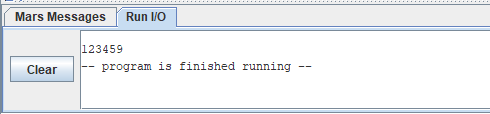

# TDE1-Assembly-Mars-MIPS
**Disciplina:** *Performance em Sistemas Ciberfísicos*

*Sistemas de Informação*, 4° período Turma B

Integrantes do Grupo: 
- *Adrian Antônio de Souza Gomes,*
- *Bruna da Silva Carnelossi,*
- *João Pedro de Souza Quintiliano da Silva,*
- *Lucas Azzolin Haubmann*

**Objetivo:**
********
Manipular assembly por meio do simulador mars mips.

Apresentar dois exemplos de programas feitos em Assembly MIPS. O Assembly MIPS é tipo de linguagem trabalha de forma mais próxima ao hardware, usando registradores, memória e instruções básicas. Nosso objetivo é entender como funcionam os fluxos de execução, as nomenclaturas principais e como manipular dados em baixo nível.
Sabendo disso foi elaborado duas atividades para compreender melhor este conteúdo:

*********

**Atividade:** Em posse do compilador os acadêmicos devem fazer dois programas.

## Atividade 1:
- Ordenar a sequencia 4,3,9,5,2,1 em forma crescente utilizando os registradores disponíveis no mars. A saída final deve ser 1,2,3,4,5,9.

- *Resolução:* Para organizar os números em ordem crescente, usamos o algoritmo chamado Bubble Sort. Ele funciona comparando elementos vizinhos e trocando de posição quando o da esquerda é maior que o da direita. Esse processo se repete até que todos estejam em ordem.
No código, nós usamos laços com rótulos (labels) como outer e inner para fazer as repetições. Usamos instruções como:

   `sll` → que multiplica o índice por 4, porque cada posição ocupa 4 bytes.

   `lw` → que carrega da memória para um registrador.

   `sw` → que guarda do registrador para a memória.

   `beq` e `bgt` → que são instruções de desvio condicional, usadas para controlar os loops.

### Código em python utilizado de inspiração para a atividade 1:

   Dessa forma, ao final do processo, a sequência fica armazenada na memória como 1, 2, 3, 4, 5, 9.
   
  *Resultado obtido no Mars da Atividade 1:*
  

*******
## Atividade 2:
- Realizar a soma do ano do nascimento dos acadêmicos do grupo, eentregar a soma como saída. Em caso de estar sozinho, realize a soma com 2025, e apresente na saída.
- *Resolução:* 
   Foi carregado os anos de nascimentos de cada participante do grupo em registradores com `li`, e depois usamos a instrução `add` para somar todos. O resultado é exibido com:
  
   `li $v0, 1` e `syscall` que são comandos que servem para imprimir um número inteiro.

  *Resultado obtido no Mars para a atividade 2:*

  

  ******

  **Video do Youtube:** aqui
  
