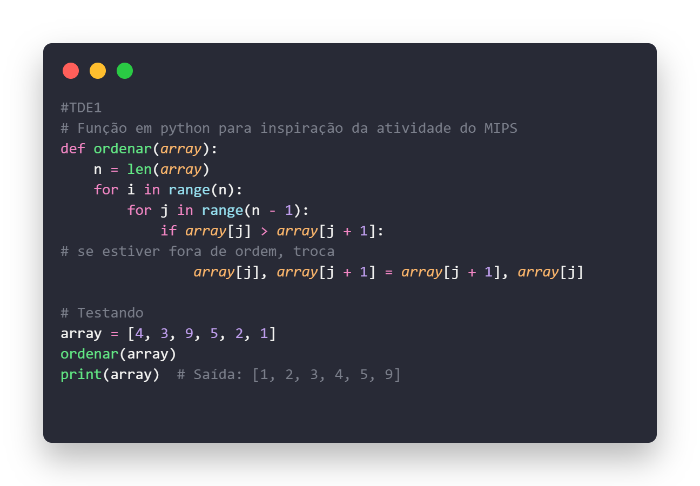

# TDE1-Assembly-Mars-MIPS
**Disciplina:** *Performance em Sistemas Ciberfísicos*

Integrantes do Grupo: 
- *Adrian Antônio de Souza Gomes,*
- *Bruna da Silva Carnelossi,*
- *João Pedro de Souza Quintiliano da Silva,*
- *Lucas Azzolin Haubmann*

Roteiro aqui:
********

Sabendo disso foi elaborado duas atividades para compreender melhor este conteúdo:

********
**Objetivo:** Manipular assembly por meio do simulador mars mips.

**Atividade:** Em posse do compilador os acadêmicos devem fazer dois programas.

## Atividade 1:
- Ordenar a sequencia 4,3,9,5,2,1 em forma crescente utilizando os registradores disponíveis no mars. A saída final deve ser 1,2,3,4,5,9.

### Código em python utilizado de inspiração para a atividade 1:

*******
## Atividade 2:
- Realizar a soma do ano do nascimento dos acadêmicos do grupo, eentregar a soma como saída. Em caso de estar sozinho, realize a soma com 2025, e apresente na saída.

  *Resultado obtido no Mars para a atividade 2*

  

  **Video do Youtube:** aqui
  
